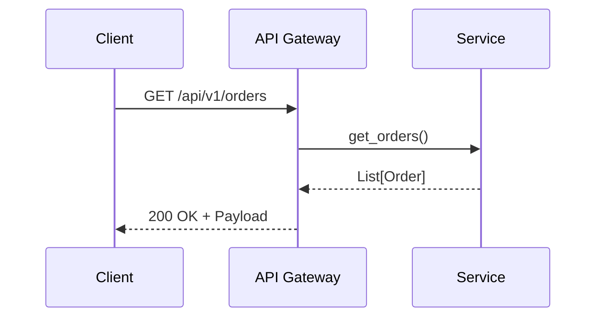

# Backend.Fastapi.Structure

---
title: Backend.Fastapi.Structure
category: specification
status: active
last_updated: 1753967677.0033057
---

### 📄 `spec.api_versioning.md`

````markdown
# Spezifikation: API Versionierung und Konventionen

## Zielsetzung
Die API-Versionierung stellt sicher, dass sich Änderungen an der API nicht rückwirkend auf bestehende Clients auswirken. Diese Spezifikation definiert einen stabilen Umgang mit API-Versionen, Logging, Fehlerbehandlung und Rückgabewerten.

---

## 1. Versionierungskonzept

### 1.1 Pfadbasierte Versionierung (empfohlen)
Verwende den API-Pfad zur Angabe der Version:
```http
/api/v1/orders
/api/v2/orders
````

* **v1** bleibt stabil
* **v2** kann inkompatible Änderungen einführen
* Bei Breaking Changes ist zwingend eine neue Version erforderlich.

### 1.2 Kein Einsatz von Query-Parametern oder Headern zur Versionierung

---

## 2. Verzeichnisstruktur

```bash
app/
├── api/
│   ├── v1/
│   │   ├── routes/
│   │   │   └── route_orders.py
│   │   └── models/
│   │       └── order_models.py
│   ├── v2/
│   │   └── ...
```

---

## 3. Logging-Konventionen

* Verwende strukturierte Logs
* Nutze standardisierte Log-Level: `info`, `warning`, `error`
* Pro API-Call: mindestens ein `info`-Eintrag mit Endpoint, Request-ID, User (sofern möglich)

```python
logger.info("📦 GET /api/v1/orders - user_id=%s", user_id)
```

---

## 4. Fehlerbehandlung und Rückgabewerte

### 4.1 Erfolgreiche Antwort

```json
{
  "status": "success",
  "message": "Order retrieved successfully",
  "data": {
    "order_id": 123,
    "status": "processing"
  }
}
```

### 4.2 Fehlermeldung (Standardisiert)

```json
{
  "status": "error",
  "message": "Order not found",
  "details": "No order found with id 123",
  "code": 404
}
```

### 4.3 HTTP Status Codes

| Code | Beschreibung             |
| ---- | ------------------------ |
| 200  | OK                       |
| 201  | Created                  |
| 400  | Bad Request (Validation) |
| 401  | Unauthorized             |
| 403  | Forbidden                |
| 404  | Not Found                |
| 500  | Internal Server Error    |

---

## 5. Dokumentation (OpenAPI / Swagger)

* Alle Versionen müssen getrennt dokumentiert sein
* Zentrale Konfiguration mit Tags (`v1`, `v2`)
* Jede Route enthält:

  * Beschreibung
  * Parameter-Validierung
  * Beispielantworten (Success/Error)

---

## 6. Testbarkeit

* Jede Version besitzt eine eigene Testabdeckung
* Testpfad: `tests/api/v1/test_orders.py`

---

## 7. Deprecation Hinweise

* Jede veraltete Version muss mit klaren Hinweisen versehen werden (in Response oder Swagger)
* Beispiel: `X-API-Deprecated: true`

---


## 8. Erweiterbarkeit

* Neue Versionen können Services und Models aus bestehenden Versionen importieren
* `v2` kann `v1.models.order_models` wiederverwenden

````

---

## 9. Visualisierung & Diagramm-Richtlinien

Um APIs, Abläufe und Strukturen besser verständlich zu machen, sollen relevante Aspekte durch **textbasierte Diagramme** visualisiert werden. Dies erleichtert Codex die Interpretation und hilft bei der automatisierten Codegenerierung.

### 9.1 🛠️ Tooling: Mermaid

Verwende [Mermaid](https://mermaid.js.org/) zur Beschreibung von:

- API-Flows
- Zustandsdiagrammen
- Sequenzabläufen
- Entity-Relations

Beispiel für einen API-Sequenzablauf:

````markdown

````

### 9.2 💡 Hinweise

- Diagramme sollen **im Markdown-Code eingebettet** werden – kein Bildformat!
- Verwende sprechende Teilnehmernamen (z. B. `User`, `Frontend`, `Backend`, `MQTT-Broker`)
- Ergänze komplexe Spezifikationen durch visuelle Darstellung direkt im zugehörigen Dokument

### 9.3 📁 Ablage

Diagramme sind **Teil der `.md`-Dateien** und werden **nicht separat** abgelegt.

---

### 🧩 Template: `route_template_fastapi.py.j2`

```python
# File: app/api/v{{ version }}/routes/route_{{ resource }}.py
# -*- coding: utf-8 -*-
"""
Route: /api/v{{ version }}/{{ resource }}

Beschreibung:
    API-Endpunkte zur Verwaltung von {{ resource | capitalize }}.

Version: v{{ version }}
Autor: Matthias Morath
"""

from fastapi import APIRouter, HTTPException, status, Request
from app.api.v{{ version }}.models.{{ resource }}_models import {{ resource | capitalize }}Response
import logging

router = APIRouter()
logger = logging.getLogger(__name__)

@router.get("/", response_model={{ resource | capitalize }}Response)
async def list_{{ resource }}(request: Request):
    """Gibt eine Liste aller {{ resource }} zurück."""
    logger.info("📥 API v{{ version }} - GET /{{ resource }}")
    try:
        # Beispiel-Dummy-Daten
        return {
            "status": "success",
            "message": "List of {{ resource }} retrieved successfully",
            "data": []
        }
    except Exception as e:
        logger.error("❌ Fehler beim Abrufen von {{ resource }}: %s", str(e))
        raise HTTPException(
            status_code=status.HTTP_500_INTERNAL_SERVER_ERROR,
            detail="Internal Server Error"
        )
````

---

### 📁 Ablage

Bitte speichere wie folgt:

```
docs/
└── codex/
    ├── spec.api_versioning.md
    └── templates/
        └── routers/
            └── route_template_fastapi.py.j2
```