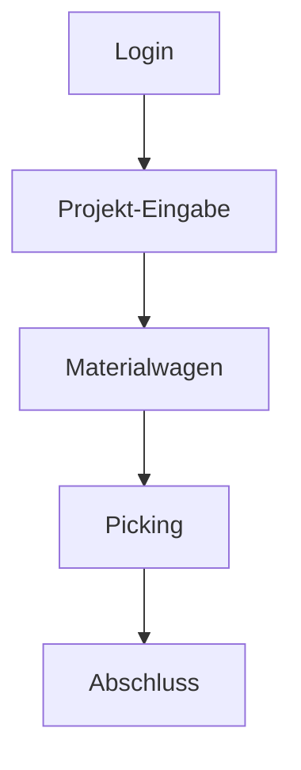

# Documentation.Diagramming

---
title: Documentation.Diagramming
category: specification
status: active
last_updated: 1753967677.0033057
---

### 📄 `docs/codex/spec.diagramm.md` 
# 📘 spec.docs.diagramming.md

## Ziel

Diese Spezifikation beschreibt Richtlinien für die Erstellung und Einbindung von textbasierten Diagrammen (z. B. Mermaid, PlantUML) in Codex-gesteuerten Spezifikationen und Dokumentationen.

---

## Diagrammtypen

| Typ        | Zweck                                      | Technologie |
|------------|--------------------------------------------|-------------|
| Flowchart  | Abläufe & UI-Schritte                      | Mermaid     |
| Class      | Modell-/Datenstruktur-Sicht                | Mermaid     |
| Sequence   | API-Aufruf- und Interaktionsflüsse         | Mermaid     |
| Wireframes | UI-Strukturen, konzeptionelle Platzhalter  | PlantUML    |

---

## Platzierung in Markdown-Dateien

- Diagramme werden **direkt unterhalb relevanter Überschriften** eingebettet
- Der Text bleibt bestehen → Diagramme dienen der **visuellen Ergänzung**
- Diagramm-Code ist **vollständig als Markdown-Codeblock** integriert

---

## Formatkonventionen (Beispiel Mermaid)

### 🖼 Visualisierung: UI-Ablauf

---

## Regeln für Codex-Nutzung

- Diagramme dürfen nicht als Bild gerendert werden (kein PNG oder SVG)
- Diagramm muss lesbar und wartbar sein
- Immer mit sprechenden Labels arbeiten
- Zusätzliche Styles (z. B. Farben) sind erlaubt, aber optional

---

## Best Practices

- Lieber einfach als vollständig – Diagramme sollen Orientierung geben, kein Overhead sein
- Bei Unsicherheit: lieber Flowchart mit Mermaid als komplexes UML
