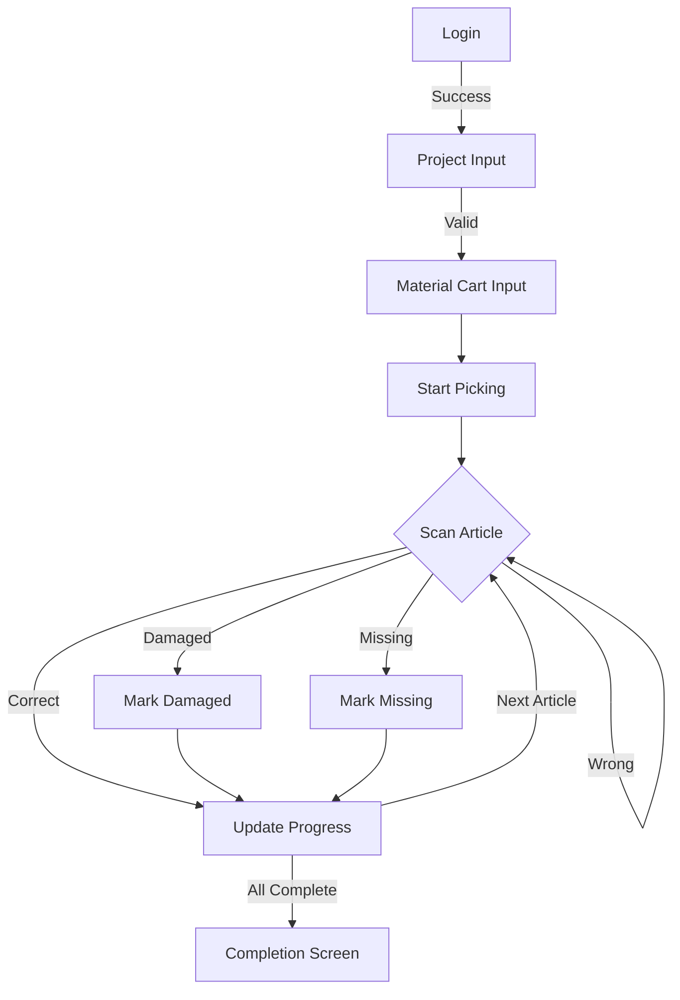

# 🏭 Kommissionierung Project

> **Scanner-optimized picking system for warehouse operations**

## 📋 Project Overview

The Kommissionierung (Picking) system is a specialized warehouse management application designed for efficient article picking operations. It features a scanner-optimized NiceGUI frontend that enables warehouse workers to quickly and accurately pick articles for project-based material carts.

## 🎯 Key Features

### 🔍 **Scanner-Optimized Interface**
- **Auto-focus** on input fields for seamless scanner workflow
- **Keyboard-free operation** - all inputs via scanner or keyboard + Enter
- **Visual feedback** with color-coded responses (green/red)
- **Audio feedback** for successful scans

### 📱 **Multi-Screen Workflow**
1. **Login Screen** - User authentication
2. **Project Input** - 6-digit project number validation
3. **Material Cart Input** - Cart ID assignment
4. **Picking Screen** - Article scanning and progress tracking
5. **Completion Screen** - Project finalization

### 🔄 **Real-time Progress Tracking**
- **Live progress bars** showing overall completion
- **Per-article progress** with "X of Y scanned" indicators
- **Backend-driven state** for session persistence
- **Error handling** for damaged or missing articles

## 🛠️ Technical Stack

### Frontend
- **NiceGUI** - Modern Python web framework
- **Scanner Integration** - Optimized for barcode scanners
- **Responsive Design** - Works on various screen sizes

### Backend
- **FastAPI** - High-performance API framework
- **REST API** - Standardized communication
- **MQTT Integration** - Real-time event publishing

## 📁 Project Documentation

### Core Specifications
- **[📄 Frontend Specification](frontend-specification.md)** - Complete UI/UX design and workflow
- **[🔧 Backend Specification](backend-specification.md)** - API design and data models
- **[📊 Project Overview](overview.md)** - System architecture and requirements

### Frontend Specification Highlights

#### 🎨 **User Interface Flow**


#### 📱 **Screen Examples**

**Login Screen:**
```
┌─────────────────────────┐
│    🔐 Login System      │
├─────────────────────────┤
│ Username: [__________]  │
│ Password: [__________]  │
│                         │
│      [Login Button]     │
└─────────────────────────┘
```

**Picking Screen:**
```
┌─────────────────────────┐
│ 📦 Article Picking      │
├─────────────────────────┤
│ Position: 5 of 40       │
│ ████████████░░░░ 60%    │
├─────────────────────────┤
│ Article: ABC123         │
│ Description: Widget XYZ │
│ Quantity: 3 pcs         │
│ Location: A1-B2-C3      │
├─────────────────────────┤
│ Scan: [__________]      │
│                         │
│ [Damaged] [Missing]     │
└─────────────────────────┘
```

#### ⚡ **Key UX Features**
- **🔍 Auto-focus** - Cursor always on relevant input field
- **⌨️ Enter-driven** - All actions completed with Enter key
- **🎨 Color feedback** - Green for success, red for errors
- **🔊 Audio signals** - Confirmation sounds for successful scans
- **📊 Progress tracking** - Real-time completion indicators

## 🚀 Getting Started

### Prerequisites
- Python 3.8+
- NiceGUI framework
- Barcode scanner (optional but recommended)
- FastAPI backend running

### Quick Start
```bash
# Clone the project
git clone <repository-url>
cd kommissionierung

# Install dependencies
pip install -r requirements.txt

# Start the frontend
python main.py
```

### Scanner Setup
1. **Configure scanner** to send Enter after each scan
2. **Test scanner** with the login screen
3. **Verify auto-focus** works correctly
4. **Check audio feedback** is enabled

## 📊 Workflow Example

### 1. **User Login**
```
Username: warehouse_user
Password: ********
→ [Login] → Success ✅
```

### 2. **Project Selection**
```
Project Number: 123456
→ [Enter] → Valid Project ✅
```

### 3. **Material Cart Assignment**
```
Cart ID: CART-001
→ [Enter] → Cart Assigned ✅
```

### 4. **Article Picking**
```
Scan: ABC123
→ Correct Article ✅ → Progress: 1/3
Scan: DEF456
→ Correct Article ✅ → Progress: 2/3
Scan: GHI789
→ Correct Article ✅ → Progress: 3/3
```

### 5. **Project Completion**
```
→ All articles picked ✅
→ Project completed successfully
→ MQTT event sent
```

## 🔧 Development

### Code Structure
```
kommissionierung/
├── frontend/
│   ├── screens/
│   │   ├── login.py
│   │   ├── project_input.py
│   │   ├── material_cart.py
│   │   ├── picking.py
│   │   └── completion.py
│   ├── components/
│   │   ├── scanner_input.py
│   │   ├── progress_bar.py
│   │   └── feedback.py
│   └── main.py
├── backend/
│   ├── api/
│   ├── models/
│   └── services/
└── docs/
    ├── frontend-specification.md
    ├── backend-specification.md
    └── overview.md
```

### API Endpoints
- `POST /auth/login` - User authentication
- `GET /project/{project_id}` - Project validation
- `POST /project/{project_id}/materialwagen` - Cart assignment
- `POST /project/{project_id}/scan` - Article scanning
- `POST /artikel/{artikel}/status` - Article status updates
- `POST /project/{project_id}/abschliessen` - Project completion

## 🎯 Benefits

### For Warehouse Workers
- **⚡ Faster picking** - Optimized scanner workflow
- **🔍 Reduced errors** - Real-time validation
- **📊 Clear progress** - Always know where you stand
- **🔄 Session recovery** - Continue where you left off

### For Management
- **📈 Real-time tracking** - Live progress monitoring
- **📊 Analytics** - Detailed picking reports
- **🔧 Easy maintenance** - Simple configuration
- **📱 Flexible deployment** - Works on any device

## 🔗 Related Documentation

### Codex Templates
- **[Frontend Templates](../../templates/components/)** - UI component templates
- **[API Templates](../../templates/routers/)** - Route definition templates
- **[Model Templates](../../templates/models/)** - Data model templates

### Specifications
- **[NiceGUI Specification](../../codex/spec.ui.nicegui.md)** - Frontend development guidelines
- **[FastAPI Structure](../../codex/spec.backend.fastapi.structure.md)** - Backend architecture
- **[API Conventions](../../codex/spec.backend.api.conventions.md)** - API design patterns

## 🚀 Future Enhancements

- **🏷️ Label printing** for damaged/missing articles
- **📋 Article overview** with filtering and search
- **📊 Pick history** per user
- **📱 Mobile optimization** for tablets and phones
- **🔔 Real-time notifications** for project updates

---

**The Kommissionierung system represents a modern, efficient approach to warehouse picking operations, combining the power of NiceGUI with scanner-optimized workflows for maximum productivity.**