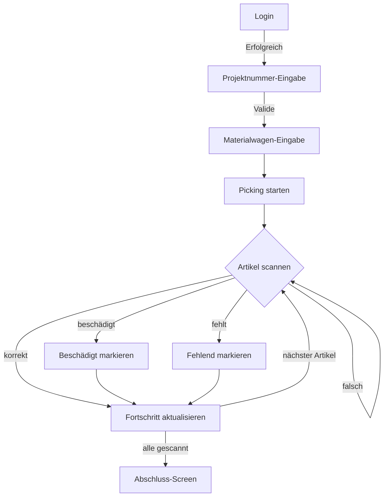
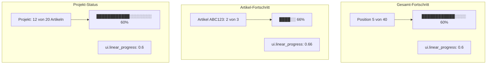
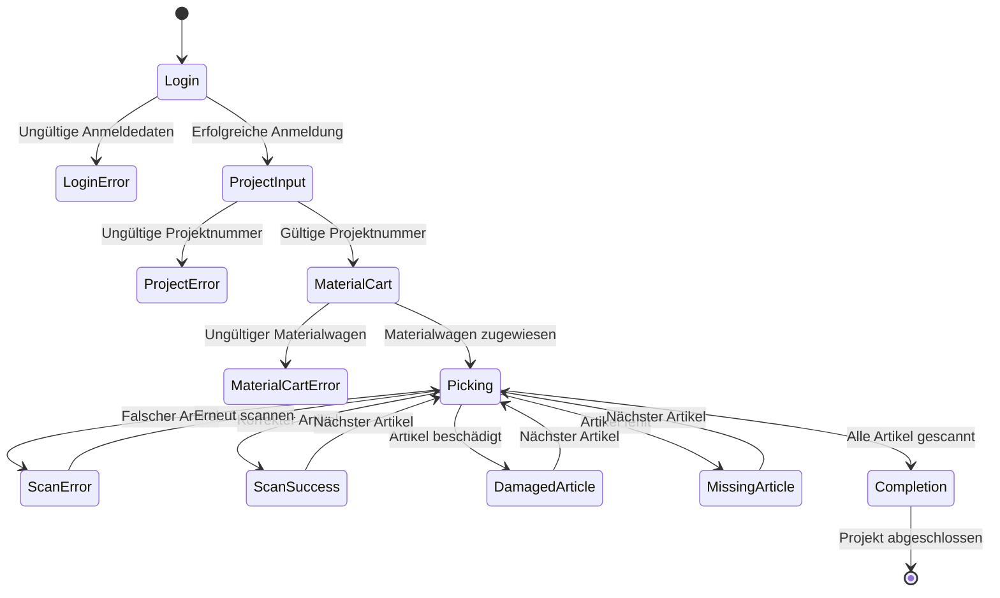

# Frontend.Kommissionierung

---
title: Frontend.Kommissionierung
category: specification
status: active
last_updated: 1753967677.0033057
---

## 📄 `spec.kommissionierung.frontend.md`

### **Ziel**

Die NiceGUI-basierte Frontend-Applikation unterstützt Kommissionierer beim Picken von Artikeln für projektgebundene Materialwagen. Die UI ist vollständig scanneroptimiert, reaktiv und bietet klare Rückmeldung zu Fortschritt, Fehlern und Sonderfällen.

---

### **Technologiestack**

* **NiceGUI**
* Optimiert für **Scanner-Workflows** mit Auto-Fokus auf Eingabefeldern
* Alle Eingaben durch **Scanner oder Tastatur + Enter**
* REST-Kommunikation mit FastAPI-Backend

---

### **Bildschirmstruktur & Logik**

---
#### 🖼 Visualisierung: UI-Ablauf für Kommissionierer



#### 🖼️ Beispiel-Wireframes

```plantuml
@startuml
skinparam handwritten true

rectangle "Login-Screen" {
  [Username input]
  [Password input]
  [Login Button]
}

rectangle "Projekt-Eingabe" {
  [ProjektNr input]
  [Enter]
}

rectangle "Picking" {
  [Artikelanzeige]
  [Scan-Feld]
  [Beschädigt] [Fehlt]
}
@enduml
```

#### 📊 Fortschritts-Visualisierung



#### 🎯 UI-Komponenten Details

```plantuml
@startuml
skinparam handwritten true

rectangle "Picking-Screen Layout" {
  rectangle "Header" {
    [Projekt: 123456]
    [Position: 5 von 40]
    [████████████░░░░ 60%]
  }

  rectangle "Artikel-Info" {
    [Artikel: ABC123]
    [Bezeichnung: Widget XYZ]
    [Menge: 3 Stück]
    [Lagerplatz: A1-B2-C3]
  }

  rectangle "Scan-Bereich" {
    [Scan-Feld: Auto-Fokus]
    [Artikel-Fortschritt: ██░░ 66%]
  }

  rectangle "Aktionen" {
    [Beschädigt] [Fehlt] [Zurück]
  }
}
@enduml
```

#### ❌ Error-States Visualisierung

```mermaid
graph TB
    subgraph "Login Error"
        A[❌ Ungültige Anmeldedaten] --> B[🔴 Roter Rahmen um Eingabefeld]
        B --> C[⚠️ Fehlermeldung: "Benutzername oder Passwort falsch"]
    end

    subgraph "Projekt Error"
        D[❌ Ungültige Projektnummer] --> E[🔴 Roter Rahmen um Projekt-Feld]
        E --> F[⚠️ Fehlermeldung: "Projekt 123456 nicht gefunden"]
    end

    subgraph "Scan Error"
        G[❌ Falscher Artikel gescannt] --> H[🔴 Roter Rahmen um Scan-Feld]
        H --> I[⚠️ Fehlermeldung: "Falscher Artikel - bitte erneut scannen"]
        I --> J[🔊 Akustisches Fehlersignal]
    end
```

#### ✅ Success-States Visualisierung

```mermaid
graph TB
    subgraph "Login Success"
        A[✅ Anmeldung erfolgreich] --> B[🟢 Grüner Rahmen um Eingabefeld]
        B --> C[🎉 Weiterleitung zu Projekt-Screen]
    end

    subgraph "Scan Success"
        D[✅ Artikel korrekt gescannt] --> E[🟢 Grüner Rahmen um Scan-Feld]
        E --> F[🔊 Akustisches Erfolgssignal]
        F --> G[📈 Fortschritt aktualisiert]
        G --> H[🔄 Auto-Fokus auf nächstes Feld]
    end

    subgraph "Projekt Success"
        I[✅ Projekt erfolgreich abgeschlossen] --> J[🎊 "Kommissionierung erfolgreich abgeschlossen"]
        J --> K[📤 Event an MQTT gesendet]
    end
```

#### 📱 Responsive Design für verschiedene Bildschirmgrößen

```plantuml
@startuml
skinparam handwritten true

rectangle "Desktop (1920x1080)" {
  rectangle "Header" {
    [Projekt: 123456] [Position: 5/40] [████████████░░░░ 60%]
  }
  rectangle "Content" {
    [Artikel-Info: Groß] [Scan-Bereich: Groß] [Aktionen: Horizontal]
  }
}

rectangle "Tablet (1024x768)" {
  rectangle "Header" {
    [Projekt: 123456] [Position: 5/40] [████████░░ 60%]
  }
  rectangle "Content" {
    [Artikel-Info: Mittel] [Scan-Bereich: Mittel] [Aktionen: Horizontal]
  }
}

rectangle "Mobile (768x1024)" {
  rectangle "Header" {
    [Projekt: 123456] [5/40] [████░░ 60%]
  }
  rectangle "Content" {
    [Artikel-Info: Klein] [Scan-Bereich: Klein] [Aktionen: Vertikal]
  }
}

rectangle "Scanner-Terminal (640x480)" {
  rectangle "Header" {
    [123456] [5/40] [████ 60%]
  }
  rectangle "Content" {
    [Artikel: ABC123] [Scan: _____] [Beschädigt] [Fehlt]
  }
}
@enduml
```

#### 🎨 UI-State Übersicht



#### 🏗️ Layout-Struktur mit Header/Footer

```plantuml
@startuml
skinparam handwritten true

rectangle "App Layout" {
  rectangle "Header" {
    [Logo: Kommissionierung] [Benutzer: Max Mustermann] [Uhrzeit: 14:30] [Logout]
  }

  rectangle "Main Content" {
    rectangle "Login Screen" {
      [Username] [Password] [Login Button]
    }

    rectangle "Project Input" {
      [Projektnummer: _____] [Enter]
    }

    rectangle "Material Cart Input" {
      [Materialwagen-ID: _____] [Enter]
    }

    rectangle "Picking Process" {
      [Artikel-Info] [Scan-Feld] [Fortschritt] [Aktionen]
    }

    rectangle "Completion" {
      [Erfolgreich abgeschlossen] [Neues Projekt]
    }
  }

  rectangle "Footer" {
    [Status: Online] [Version: 1.0.0] [Support: #123]
  }
}
@enduml
```

#### 📱 Responsive Layout mit Header/Footer

```plantuml
@startuml
skinparam handwritten true

rectangle "Desktop Layout" {
  rectangle "Header (100px)" {
    [Logo] [User] [Time] [Logout]
  }
  rectangle "Content (calc(100vh-200px))" {
    [Login/Project/Material/Picking/Completion]
  }
  rectangle "Footer (100px)" {
    [Status] [Version] [Support]
  }
}

rectangle "Tablet Layout" {
  rectangle "Header (80px)" {
    [Logo] [User] [Logout]
  }
  rectangle "Content (calc(100vh-160px))" {
    [Login/Project/Material/Picking/Completion]
  }
  rectangle "Footer (80px)" {
    [Status] [Version]
  }
}

rectangle "Mobile Layout" {
  rectangle "Header (60px)" {
    [Logo] [User]
  }
  rectangle "Content (calc(100vh-120px))" {
    [Login/Project/Material/Picking/Completion]
  }
  rectangle "Footer (60px)" {
    [Status]
  }
}
@enduml
```

#### **1. Login-Screen**

* **Header:** Logo, Uhrzeit, Version
* **Content:** Eingabefelder: `username`, `password`
* **Footer:** Status, Support-Nummer
* **API:** POST `/auth/login`
* **Fehler:** Rote Rahmen, Fehlermeldung bei ungültigen Anmeldedaten
* **Erfolg:** Grüner Rahmen, Speichern des Tokens, Wechsel zu Projekt-Screen

---

#### **2. Projekt-Eingabe-Screen**

* Eingabe: `projekt_nr` (6-stellige Ziffernfolge)
* Auto-Fokus auf Eingabefeld
* Scanner- oder Tastatureingabe, Abschluss durch Enter
* Validierung via `GET /project/{projekt_nr}`
* Bei Fehler: rotes Eingabefeld, Textmeldung („Ungültige Projektnummer“)
* Bei Erfolg → Weiterleitung zu Materialwagen-Screen

---

#### **3. Materialwagen-Eingabe-Screen**

* **Header:** Logo, Benutzer, Uhrzeit, Logout-Button
* **Content:** Eingabe: Materialwagen-ID (Scanner/Tastatur)
* **Footer:** Status, Version, Support
* **Auto-Fokus:** Auf Eingabefeld
* **API:** POST `/project/{projekt_nr}/materialwagen`
* **Fehler:** Roter Rahmen, Textmeldung („Ungültiger Materialwagen")
* **Erfolg:** Grüner Rahmen, Start des Picking-Prozesses

---

#### **4. Picking-Screen**

* **Header:** Logo, Benutzer, Uhrzeit, Logout-Button, Projekt-Nr
* **Content:** Artikel-Scanning und Fortschritt
* **Footer:** Status, Version, Support

##### Artikelanzeige:

* Für jeden aktiven Artikel:

  * `artikel` (interne Artikelnummer)
  * `artikel_bezeichnung`
  * `menge`
  * `einheit`
  * `lagerplatz`
* Zusätzliche Anzeige:

  * `Position X von Y` (z. B. „5 von 40“)
  * Fortschrittsbalken (NiceGUI `ui.linear_progress`), aktualisiert nach jeder Artikelposition

##### Eingabe:

* Scanner/Tastatur → Artikelnummer oder Hersteller-Artikelnummer
* Auto-Fokus im Eingabefeld
* Eingabe-Validierung via `POST /project/{projekt_nr}/scan`

##### Feedback:

* ✅ Korrekt:

  * Grüner Rahmen um Eingabefeld
  * Akustisches Signal (sofern vom Browser unterstützt)
  * Fortschrittszähler `anzahl_auf_wagen += 1`
  * Bei `anzahl_auf_wagen == menge`: nächster Artikel wird automatisch geladen

* ❌ Falsch:

  * Roter Rahmen
  * Fehlernachricht: „Falscher Artikel – bitte erneut scannen“

##### Fortschritt pro Artikel:

* Anzeige: `x von menge gescannt` (z. B. „2 von 3 gescannt“)
* Optional in Balkenform (pro Artikel)

##### Sonderfälle (manuelle Aktionen):

* Buttons:

  * `Artikel beschädigt` → `POST /artikel/{artikel}/status` mit Flag
  * `Artikel fehlt` → dito
* UI zeigt danach Restmenge korrekt an

---

#### **5. Abschluss-Screen**

* **Header:** Logo, Benutzer, Uhrzeit, Logout-Button
* **Content:** Abschluss-Bestätigung
* **Footer:** Status, Version, Support

* Wenn alle Positionen abgeschlossen:

  * Anzeige: **„Kommissionierung erfolgreich abgeschlossen“**
  * POST `/project/{projekt_nr}/abschliessen`
  * Event `projekt_kommissioniert` wird an MQTT gesendet
* Optional: Button „Neues Projekt starten“

---

### **UX-Konventionen (scanneroptimiert)**

* Cursor **immer** auf dem relevanten Eingabefeld
* Enter/Return schließt Eingabe ab
* Keine Maus erforderlich
* Akustisches Feedback bei erfolgreichem Scan
* Farbcodiertes visuelles Feedback bei Fehlern

---

### **Datenbezug / State**

* Projektdaten und Picking-Status werden **vollständig vom Backend geliefert**
* Frontend verwaltet keine persistente State-Kopie
* Fortschritt ist stets backendgetrieben → ermöglicht Session-Fortsetzung

---

### **Persistenz bei Abbruch**

* Wenn der Pick-Vorgang unterbrochen wird (z. B. Browser geschlossen, Nutzerwechsel):

  * Der Fortschritt ist beim nächsten Aufruf des Projekts **wiederhergestellt**
  * Artikel mit `anzahl_auf_wagen > 0` erscheinen mit Restmenge

---

### **Zukunftserweiterungen**

* Etikettendruck bei Sonderfällen (via Backend-Trigger)
* Tabellenübersicht über alle Artikel und Scan-Zustände
* Filter/Suche für Artikel im Pickingprozess
* Detailansicht für Pickhistorie pro Benutzer
