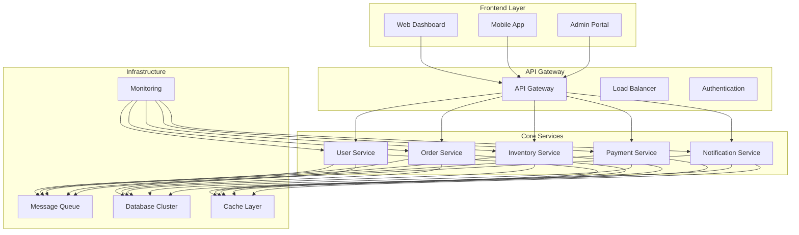
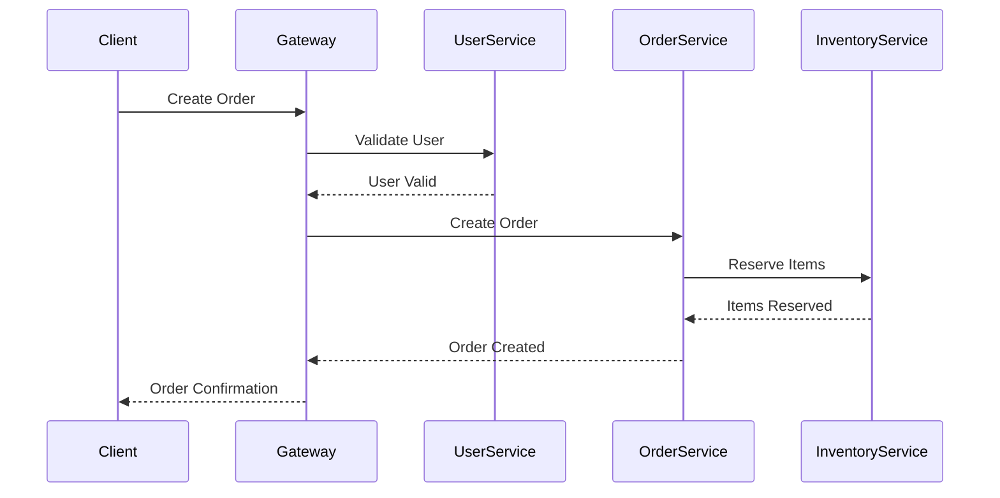
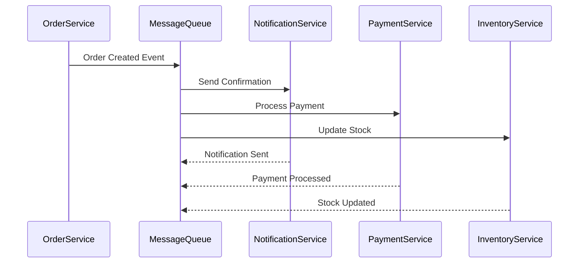
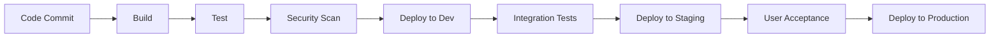

# 🏗️ Microservice Platform Project

> **Enterprise-grade microservice platform with distributed architecture**

## 📋 Project Overview

The Microservice Platform is a comprehensive enterprise application built using a distributed microservice architecture. It consists of multiple specialized services that communicate through APIs, message queues, and event-driven patterns.

## 🏛️ Architecture Overview

## 🎯 Project Goals

- **Scalability:** Independent scaling of services based on demand
- **Resilience:** Fault isolation and graceful degradation
- **Maintainability:** Clear service boundaries and responsibilities
- **Performance:** Optimized communication and caching strategies
- **Security:** Centralized authentication and authorization
- **Observability:** Comprehensive monitoring and logging

## 🏗️ Service Architecture

### 📱 Frontend Services

#### Web Dashboard (`frontend-dashboard`)
- **Technology:** React + TypeScript
- **Purpose:** Main user interface for business operations
- **Features:** Real-time data visualization, user management, reporting
- **Specification:** [Frontend Dashboard Spec](frontend-dashboard-specification.md)

#### Mobile Application (`frontend-mobile`)
- **Technology:** React Native
- **Purpose:** Mobile access for field operations
- **Features:** Offline capabilities, push notifications, GPS tracking
- **Specification:** [Mobile App Spec](frontend-mobile-specification.md)

#### Admin Portal (`frontend-admin`)
- **Technology:** Vue.js + Element UI
- **Purpose:** Administrative interface for system management
- **Features:** User management, system configuration, monitoring
- **Specification:** [Admin Portal Spec](frontend-admin-specification.md)

### 🔧 Backend Services

#### API Gateway (`backend-gateway`)
- **Technology:** FastAPI + Kong
- **Purpose:** Central entry point for all client requests
- **Features:** Rate limiting, authentication, request routing, logging
- **Specification:** [API Gateway Spec](backend-gateway-specification.md)

#### User Service (`backend-user-service`)
- **Technology:** FastAPI + PostgreSQL
- **Purpose:** User management and authentication
- **Features:** User CRUD, authentication, authorization, profile management
- **Specification:** [User Service Spec](backend-user-service-specification.md)

#### Order Service (`backend-order-service`)
- **Technology:** FastAPI + MongoDB
- **Purpose:** Order processing and management
- **Features:** Order creation, status tracking, workflow management
- **Specification:** [Order Service Spec](backend-order-service-specification.md)

#### Inventory Service (`backend-inventory-service`)
- **Technology:** FastAPI + Redis + PostgreSQL
- **Purpose:** Inventory and stock management
- **Features:** Stock tracking, reservations, low stock alerts
- **Specification:** [Inventory Service Spec](backend-inventory-service-specification.md)

#### Payment Service (`backend-payment-service`)
- **Technology:** FastAPI + PostgreSQL
- **Purpose:** Payment processing and financial operations
- **Features:** Payment processing, refunds, financial reporting
- **Specification:** [Payment Service Spec](backend-payment-service-specification.md)

#### Notification Service (`backend-notification-service`)
- **Technology:** FastAPI + Redis + RabbitMQ
- **Purpose:** Multi-channel notification delivery
- **Features:** Email, SMS, push notifications, notification preferences
- **Specification:** [Notification Service Spec](backend-notification-service-specification.md)

### 🗄️ Infrastructure Services

#### Message Queue (`infrastructure-message-queue`)
- **Technology:** RabbitMQ + Redis
- **Purpose:** Inter-service communication and event streaming
- **Features:** Message routing, dead letter queues, event sourcing
- **Specification:** [Message Queue Spec](infrastructure-message-queue-specification.md)

#### Database Cluster (`infrastructure-database`)
- **Technology:** PostgreSQL + Redis + MongoDB
- **Purpose:** Data persistence and caching
- **Features:** Master-slave replication, sharding, backup strategies
- **Specification:** [Database Spec](infrastructure-database-specification.md)

#### Monitoring Stack (`infrastructure-monitoring`)
- **Technology:** Prometheus + Grafana + ELK Stack
- **Purpose:** System monitoring and observability
- **Features:** Metrics collection, alerting, log aggregation
- **Specification:** [Monitoring Spec](infrastructure-monitoring-specification.md)

## 🔄 Service Communication

### Synchronous Communication

### Asynchronous Communication

## 📊 Data Flow Architecture

### Event-Driven Architecture
- **Event Sourcing:** All state changes are captured as events
- **CQRS:** Command Query Responsibility Segregation
- **Event Store:** Centralized event storage and replay capabilities
- **Saga Pattern:** Distributed transaction management

### Data Consistency
- **Eventual Consistency:** Most operations are eventually consistent
- **Strong Consistency:** Critical operations (payments, inventory) use strong consistency
- **Compensation:** Failed operations are compensated through rollback mechanisms

## 🔐 Security Architecture

### Authentication & Authorization
- **JWT Tokens:** Stateless authentication
- **OAuth 2.0:** Third-party authentication
- **RBAC:** Role-based access control
- **API Keys:** Service-to-service authentication

### Data Protection
- **Encryption at Rest:** All sensitive data encrypted
- **Encryption in Transit:** TLS 1.3 for all communications
- **Data Masking:** Sensitive data masked in logs
- **Audit Logging:** Complete audit trail for all operations

## 🚀 Deployment Strategy

### Container Orchestration
- **Kubernetes:** Container orchestration and scaling
- **Docker:** Containerization of all services
- **Helm Charts:** Kubernetes deployment templates
- **Service Mesh:** Istio for service-to-service communication

### CI/CD Pipeline

## 📈 Monitoring & Observability

### Metrics Collection
- **Application Metrics:** Response times, error rates, throughput
- **Infrastructure Metrics:** CPU, memory, disk, network
- **Business Metrics:** Orders, revenue, user activity
- **Custom Metrics:** Domain-specific business KPIs

### Alerting Strategy
- **Critical Alerts:** Service down, high error rates
- **Warning Alerts:** Performance degradation, resource usage
- **Business Alerts:** Unusual business patterns
- **Escalation:** Automated escalation to on-call engineers

## 🔧 Development Workflow

### Service Development
1. **Service Template:** Use standardized service templates
2. **API First:** Define APIs before implementation
3. **Contract Testing:** Ensure service compatibility
4. **Integration Testing:** Test service interactions
5. **Performance Testing:** Load testing for each service

### Code Quality
- **Linting:** Consistent code style across services
- **Testing:** Unit, integration, and contract tests
- **Security:** Automated security scanning
- **Documentation:** API documentation and service guides

## 📚 Documentation Structure

### Service Documentation
Each service has its own specification document:
- **Architecture Overview:** Service design and responsibilities
- **API Documentation:** REST API specifications
- **Data Models:** Database schemas and data structures
- **Deployment Guide:** How to deploy and configure
- **Troubleshooting:** Common issues and solutions

### Cross-Service Documentation
- **Integration Guide:** How services communicate
- **Data Flow Diagrams:** End-to-end process flows
- **Error Handling:** Error codes and recovery procedures
- **Performance Guidelines:** Optimization recommendations

## 🎯 Success Metrics

### Technical Metrics
- **Availability:** 99.9% uptime target
- **Response Time:** < 200ms for 95% of requests
- **Error Rate:** < 0.1% error rate
- **Deployment Frequency:** Multiple deployments per day

### Business Metrics
- **User Satisfaction:** > 4.5/5 rating
- **System Performance:** < 1s page load times
- **Feature Delivery:** 2-week sprint cycles
- **Cost Efficiency:** Optimized resource utilization

## 🔗 Related Documentation

### Service Specifications
- **[Frontend Dashboard](frontend-dashboard-specification.md)** - Web dashboard specification
- **[Mobile Application](frontend-mobile-specification.md)** - Mobile app specification
- **[Admin Portal](frontend-admin-specification.md)** - Admin interface specification
- **[API Gateway](backend-gateway-specification.md)** - Gateway service specification
- **[User Service](backend-user-service-specification.md)** - User management specification
- **[Order Service](backend-order-service-specification.md)** - Order processing specification
- **[Inventory Service](backend-inventory-service-specification.md)** - Inventory management specification
- **[Payment Service](backend-payment-service-specification.md)** - Payment processing specification
- **[Notification Service](backend-notification-service-specification.md)** - Notification delivery specification

### Infrastructure Specifications
- **[Message Queue](infrastructure-message-queue-specification.md)** - Message queue specification
- **[Database](infrastructure-database-specification.md)** - Database architecture specification
- **[Monitoring](infrastructure-monitoring-specification.md)** - Monitoring stack specification

### Codex Templates Used
- **[FastAPI Structure](../../codex/spec.backend.fastapi.structure.md)** - Backend service patterns
- **[API Conventions](../../codex/spec.backend.api.conventions.md)** - API design standards
- **[Frontend NiceGUI](../../codex/spec.ui.nicegui.md)** - Frontend development patterns
- **[Project Structure](../../codex/spec.project.structure.md)** - Overall project organization
- **[Quality Standards](../../codex/spec.quality.code.md)** - Code quality guidelines
- **[Testing Standards](../../codex/spec.quality.testing.md)** - Testing strategies
- **[Security Guidelines](../../codex/spec.quality.security.md)** - Security best practices

---

**The Microservice Platform represents a modern, scalable approach to enterprise application development, combining the power of distributed systems with clear service boundaries and comprehensive monitoring.**