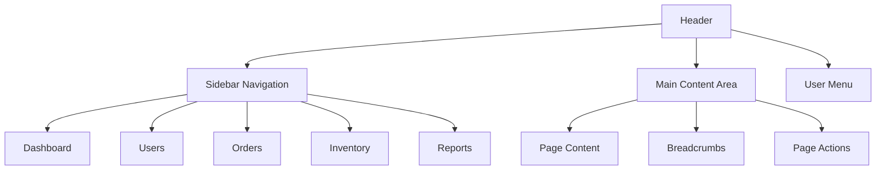

# 📊 Frontend Dashboard Specification

---
title: Frontend Dashboard
category: frontend
status: active
last_updated: 2024-01-15
---

## 📋 Service Overview

The Frontend Dashboard is the primary web interface for the microservice platform, providing users with a comprehensive view of business operations, real-time data visualization, and interactive management capabilities.

## 🏗️ Architecture

### Technology Stack
- **Framework:** React 18 + TypeScript
- **State Management:** Redux Toolkit + RTK Query
- **UI Library:** Material-UI (MUI) v5
- **Routing:** React Router v6
- **Build Tool:** Vite
- **Testing:** Jest + React Testing Library
- **Styling:** Emotion + CSS-in-JS

### Application Structure
```
src/
├── components/          # Reusable UI components
├── pages/              # Page components
├── features/           # Redux slices and features
├── services/           # API service layer
├── hooks/              # Custom React hooks
├── utils/              # Utility functions
├── types/              # TypeScript type definitions
├── assets/             # Static assets
└── styles/             # Global styles and themes
```

## 🎨 UI/UX Design

### Design System
- **Color Palette:** Material Design 3 color system
- **Typography:** Roboto font family with defined hierarchy
- **Spacing:** 8px grid system
- **Components:** Consistent component library
- **Responsive:** Mobile-first responsive design

### Layout Structure


### Key Pages

#### Dashboard Overview
- **Real-time Metrics:** Key performance indicators
- **Charts & Graphs:** Data visualization components
- **Recent Activity:** Latest system events
- **Quick Actions:** Common user actions
- **Alerts & Notifications:** System alerts and user notifications

#### User Management
- **User List:** Paginated user table with search and filters
- **User Details:** Comprehensive user profile view
- **User Creation:** Multi-step user creation form
- **Role Management:** Role assignment and permission management

#### Order Management
- **Order List:** Advanced order table with status tracking
- **Order Details:** Complete order information and history
- **Order Creation:** Guided order creation workflow
- **Order Analytics:** Order trends and performance metrics

## 🔌 API Integration

### Service Layer Architecture
```typescript
// services/api.ts
interface ApiService {
  // User Service
  getUsers(params: UserListParams): Promise<UserListResponse>
  getUser(id: string): Promise<User>
  createUser(user: CreateUserRequest): Promise<User>
  updateUser(id: string, user: UpdateUserRequest): Promise<User>
  deleteUser(id: string): Promise<void>
  
  // Order Service
  getOrders(params: OrderListParams): Promise<OrderListResponse>
  getOrder(id: string): Promise<Order>
  createOrder(order: CreateOrderRequest): Promise<Order>
  updateOrder(id: string, order: UpdateOrderRequest): Promise<Order>
  
  // Inventory Service
  getInventory(params: InventoryListParams): Promise<InventoryListResponse>
  getInventoryItem(id: string): Promise<InventoryItem>
  updateInventory(id: string, item: UpdateInventoryRequest): Promise<InventoryItem>
  
  // Analytics Service
  getDashboardMetrics(): Promise<DashboardMetrics>
  getAnalyticsReport(params: AnalyticsParams): Promise<AnalyticsReport>
}
```

### Real-time Updates
- **WebSocket Connection:** Real-time data updates
- **Event Streaming:** Live event notifications
- **Optimistic Updates:** Immediate UI updates with rollback
- **Background Sync:** Offline data synchronization

## 📊 State Management

### Redux Store Structure
```typescript
interface RootState {
  auth: AuthState
  users: UsersState
  orders: OrdersState
  inventory: InventoryState
  analytics: AnalyticsState
  ui: UIState
  notifications: NotificationsState
}
```

### RTK Query Configuration
```typescript
// services/apiSlice.ts
export const apiSlice = createApi({
  reducerPath: 'api',
  baseQuery: fetchBaseQuery({
    baseUrl: '/api/v1',
    prepareHeaders: (headers, { getState }) => {
      const token = (getState() as RootState).auth.token
      if (token) {
        headers.set('authorization', `Bearer ${token}`)
      }
      return headers
    },
  }),
  tagTypes: ['User', 'Order', 'Inventory', 'Analytics'],
  endpoints: (builder) => ({
    // User endpoints
    getUsers: builder.query<UserListResponse, UserListParams>({
      query: (params) => ({ url: '/users', params }),
      providesTags: ['User'],
    }),
    
    // Order endpoints
    getOrders: builder.query<OrderListResponse, OrderListParams>({
      query: (params) => ({ url: '/orders', params }),
      providesTags: ['Order'],
    }),
    
    // Analytics endpoints
    getDashboardMetrics: builder.query<DashboardMetrics, void>({
      query: () => '/analytics/dashboard',
      providesTags: ['Analytics'],
    }),
  }),
})
```

## 🔐 Authentication & Authorization

### Authentication Flow
1. **Login Form:** Username/password authentication
2. **Token Storage:** Secure token storage in memory
3. **Token Refresh:** Automatic token refresh before expiration
4. **Logout:** Secure logout with token invalidation

### Authorization
- **Route Guards:** Protected route components
- **Permission Checks:** Component-level permission validation
- **Role-based UI:** Dynamic UI based on user roles
- **Feature Flags:** Feature toggle system

## 📱 Responsive Design

### Breakpoints
- **Mobile:** < 768px
- **Tablet:** 768px - 1024px
- **Desktop:** > 1024px
- **Large Desktop:** > 1440px

### Mobile Optimizations
- **Touch-friendly:** Large touch targets
- **Swipe Gestures:** Intuitive swipe navigation
- **Offline Support:** Progressive Web App features
- **Performance:** Optimized for mobile networks

## 🎯 Performance Optimization

### Code Splitting
- **Route-based:** Lazy loading of page components
- **Component-based:** Dynamic imports for heavy components
- **Vendor Splitting:** Separate vendor bundle optimization

### Caching Strategy
- **Browser Cache:** Static asset caching
- **API Cache:** RTK Query caching with invalidation
- **Service Worker:** Offline caching and background sync
- **CDN:** Content delivery network for static assets

### Performance Metrics
- **First Contentful Paint:** < 1.5s
- **Largest Contentful Paint:** < 2.5s
- **Cumulative Layout Shift:** < 0.1
- **First Input Delay:** < 100ms

## 🧪 Testing Strategy

### Unit Tests
- **Component Testing:** Individual component behavior
- **Hook Testing:** Custom hook functionality
- **Utility Testing:** Pure function testing
- **Service Testing:** API service layer testing

### Integration Tests
- **User Flows:** End-to-end user workflows
- **API Integration:** Service integration testing
- **State Management:** Redux store testing
- **Routing:** Navigation and routing testing

### Visual Regression Tests
- **Component Screenshots:** Visual component testing
- **Page Screenshots:** Full page visual testing
- **Cross-browser:** Multi-browser compatibility testing

## 🚀 Deployment

### Build Configuration
```typescript
// vite.config.ts
export default defineConfig({
  plugins: [react()],
  build: {
    outDir: 'dist',
    sourcemap: true,
    rollupOptions: {
      output: {
        manualChunks: {
          vendor: ['react', 'react-dom'],
          mui: ['@mui/material', '@mui/icons-material'],
          redux: ['@reduxjs/toolkit', 'react-redux'],
        },
      },
    },
  },
  server: {
    proxy: {
      '/api': {
        target: 'http://localhost:8000',
        changeOrigin: true,
      },
    },
  },
})
```

### Environment Configuration
```typescript
// config/environment.ts
interface Environment {
  API_BASE_URL: string
  WS_BASE_URL: string
  ENVIRONMENT: 'development' | 'staging' | 'production'
  FEATURE_FLAGS: Record<string, boolean>
  ANALYTICS_ID?: string
}
```

### Docker Configuration
```dockerfile
# Dockerfile
FROM node:18-alpine as builder
WORKDIR /app
COPY package*.json ./
RUN npm ci --only=production
COPY . .
RUN npm run build

FROM nginx:alpine
COPY --from=builder /app/dist /usr/share/nginx/html
COPY nginx.conf /etc/nginx/nginx.conf
EXPOSE 80
CMD ["nginx", "-g", "daemon off;"]
```

## 📊 Analytics & Monitoring

### User Analytics
- **Page Views:** Track user navigation patterns
- **User Actions:** Monitor user interactions
- **Performance Metrics:** Track application performance
- **Error Tracking:** Monitor and report errors

### Business Metrics
- **User Engagement:** Time spent, pages visited
- **Feature Usage:** Most used features and workflows
- **Conversion Funnel:** User journey analysis
- **A/B Testing:** Feature comparison and optimization

## 🔧 Development Workflow

### Development Environment
- **Hot Reload:** Fast development feedback
- **TypeScript:** Type safety and IntelliSense
- **ESLint + Prettier:** Code quality and formatting
- **Husky:** Pre-commit hooks for quality checks

### Code Quality
- **TypeScript:** Strict type checking
- **ESLint:** Code linting and best practices
- **Prettier:** Code formatting
- **Jest:** Unit and integration testing

### Git Workflow
- **Feature Branches:** Feature-based development
- **Pull Requests:** Code review and quality gates
- **Automated Testing:** CI/CD pipeline integration
- **Deployment:** Automated deployment to environments

## 📚 Documentation

### Component Documentation
- **Storybook:** Interactive component documentation
- **API Documentation:** Service layer documentation
- **User Guides:** End-user documentation
- **Developer Guides:** Technical implementation guides

### Code Documentation
- **JSDoc:** Function and component documentation
- **README:** Project setup and development guide
- **Architecture Docs:** System design documentation
- **API Specs:** OpenAPI specifications

## 🔗 Dependencies

### Internal Services
- **API Gateway:** All API communication
- **Authentication Service:** User authentication
- **Notification Service:** Real-time notifications
- **Analytics Service:** Data visualization

### External Services
- **CDN:** Static asset delivery
- **Monitoring:** Application performance monitoring
- **Analytics:** User behavior tracking
- **Error Tracking:** Error monitoring and reporting

---

**The Frontend Dashboard provides a modern, responsive, and performant user interface for the microservice platform, delivering an excellent user experience across all devices and use cases.** 